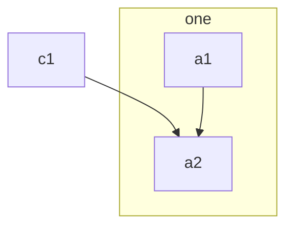

We want to redraw a version of this image:

From this document: https://nsf-gov-resources.nsf.gov/files/antarctica-07232012.pdf

Here's a flowchart in mermaid:

```mermaid
flowchart TB
    c1-->a2
    subgraph ide1 [one]
    a1-->a2
    end
```
